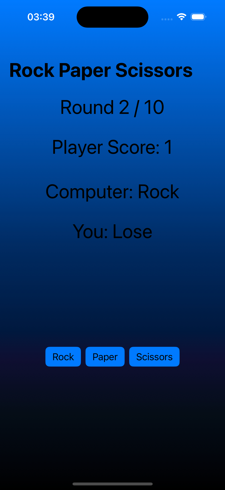

# Rock Paper Scissors Game

A simple Rock Paper Scissors game implemented using SwiftUI for iOS.

## Game Description

This game follows the classic rules of Rock Paper Scissors. Each turn, the app randomly picks either rock, paper, or scissors, and prompts the player to either win or lose the round. The player must then tap the correct move to win or lose the game. If they are correct, they score a point; otherwise, they lose a point. The game ends after 10 rounds, at which point the final score is shown.

## Installation

To install and run the game on your iOS device:

1. Clone this repository.
2. Open the project in Xcode.
3. Build and run the project on your iOS device or simulator.

## Usage

Simply tap on the move (Rock, Paper, or Scissors) that you believe will win or lose the round. After 10 rounds, the final score will be displayed.

## Screenshots

## Credits

- **Developer:** Om Preetham Bandi

## License

This project is licensed under the [LICENSE](LICENSE).

